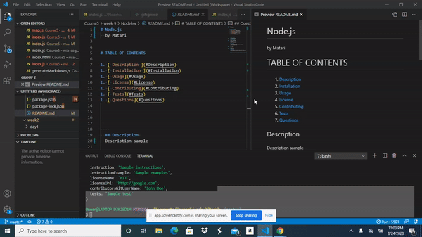

# Node.js
  by Matari

# TABLE OF CONTENTS

1. [ Description ](#Description)
1. [ Installation ](#Installation)
1. [ Usage](#Usage)
1. [ License](#License)
1. [ Contributing](#Contributing)
1. [ Tests](#Tests)
1. [ Questions](#Questions)

    
  ## Description 
  Description sample

  ## Installation
  Steps 1 and Steps2

  ## Usage
  Sample instructions

  ## License
  

  ## Contributing
  John Doe

  ## Tests
  Sample test

  ## Questions
  If you have any questions contact me at data.email

  